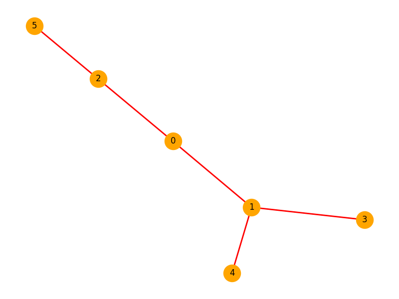

## How to run:
    g++ ./Searching/Breadth-FirstSearch/bfs.cpp ./Searching/Breadth-FirstSearch/bfs.cpp -o bfs 
### To enable C++11, use the following command:
    g++ -std=c++11 ./Searching/Breadth-FirstSearch/bfs.cpp -o ./Searching/Breadth-FirstSearch/bfs.cpp -o bfs 
#### To run the program, use this command:
    ./bfs

### run the python file to generarte the plot
python3 ./Searching/Breadth-FirstSearch/bfc_plot.py

## Explanation:

1.	Graph Representation: We use an adjacency list (adjList) to represent the graph. 
    The Graph class manages the graph structure.
2.	BFS Method: We implement BFS using a queue (std::queue) to keep track of 
    the current node being processed, and a set (std::unordered_set) to track visited nodes.
3.	Edge Addition: The addEdge function adds edges to the graph. In this case, it’s undirected, 
    so for every edge from u to v, we also add an edge from v to u.
4.	Main Function: The BFS starts from vertex 0, but this can be changed to any other vertex. 
    It prints each visited node during the traversal.

Breadth-First Search starting from vertex 0:
Visited 0
Visited 1
Visited 2
Visited 3
Visited 4
Visited 5

## BFS Traversal

### Usage / Practical cases

Breadth-First Search (BFS) has a variety of practical applications across different fields, thanks to its systematic exploration of graph structures. Here are some real-world use cases where BFS can be used effectively:

1. Shortest Path in Unweighted Graphs

	•	Use Case: BFS is often used to find the shortest path between two nodes in an unweighted graph, such as in maps, social networks, or any unweighted connections.
	•	Example: In a transportation network (e.g., metro lines or road networks), BFS can help find the shortest route between two stations or intersections without considering distances, assuming all edges have equal weight.

2. Web Crawlers

	•	Use Case: Web crawlers use BFS to systematically explore the web. Starting from a given URL, the crawler visits all the linked pages in a breadth-first manner.
	•	Example: Google’s web crawler can use BFS to discover new webpages. It starts from a known URL and then explores all the pages linked from that URL before moving on to the links in those pages, ensuring broad coverage.

3. Peer-to-Peer Networks

	•	Use Case: BFS can be used in peer-to-peer networks like BitTorrent to search for peers for file sharing.
	•	Example: When a peer in the network wants to download a file, it can use BFS to find other peers who have the required data by searching layer by layer.

4. Social Network Analysis

	•	Use Case: BFS can help analyze connections and relationships in social networks, such as finding people within a certain degree of separation.
	•	Example: On social platforms like Facebook or LinkedIn, BFS is used to suggest friends or connections, showing friends of friends within a limited number of degrees (e.g., “people you may know”).

5. Solving Puzzles and Games

	•	Use Case: BFS can be used to find the solution to certain types of puzzles or games, especially those that involve moving through states in a defined way (e.g., mazes, chess).
	•	Example: In a maze-solving algorithm, BFS can be used to explore all possible paths from the start to the end and determine the shortest path if one exists.

6. Network Broadcasting

	•	Use Case: BFS can help in broadcasting a message or data packet across a network by ensuring that all nodes (e.g., routers or computers) receive the message.
	•	Example: In a computer network, a router may use BFS to send data to all reachable routers within the network, ensuring that the message propagates efficiently.

7. Finding Connected Components

	•	Use Case: BFS can help determine all connected components in a graph, which is important in network connectivity and cluster detection.
	•	Example: In a graph representing different social groups or communities, BFS can be used to identify clusters of people who are all connected directly or indirectly.

8. Garbage Collection in Memory Management

	•	Use Case: In languages with automatic memory management (e.g., Java, Python), BFS can be used to traverse the object reference graph during garbage collection.
	•	Example: The garbage collector identifies reachable objects from a root node, ensuring that only unreachable objects are marked for cleanup.

9. Broadcasting and Spanning Trees in Computer Networks

	•	Use Case: BFS can be used to construct spanning trees that are used in broadcasting protocols and multicasting in computer networks.
	•	Example: When transmitting a message from one node to all others in a network, BFS can help in building an efficient spanning tree that reaches all nodes with minimal retransmissions.

10. Artificial Intelligence (AI) and Robotics

	•	Use Case: BFS is used in AI for problem-solving in graph traversal problems, like state-space search problems, which include finding the optimal sequence of actions.
	•	Example: In robotics, BFS can help a robot navigate through an environment to reach a target while avoiding obstacles. The robot can explore nearby spaces first before venturing farther, ensuring an optimal path.

These examples show how BFS is a versatile algorithm applicable in diverse fields ranging from networking to artificial intelligence and beyond.